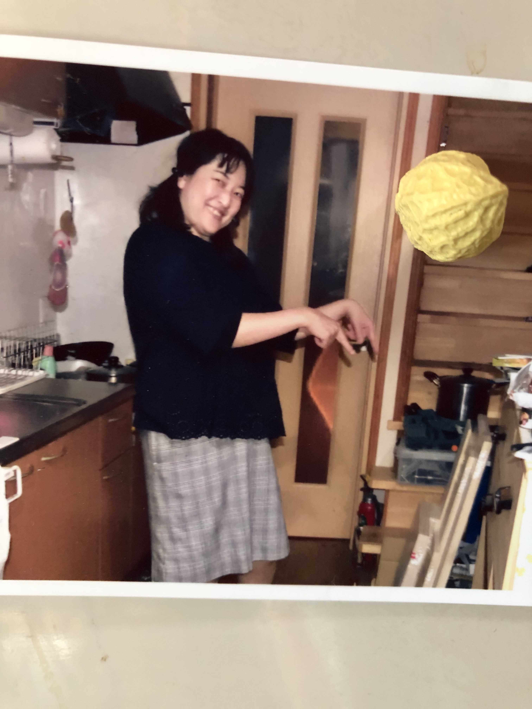
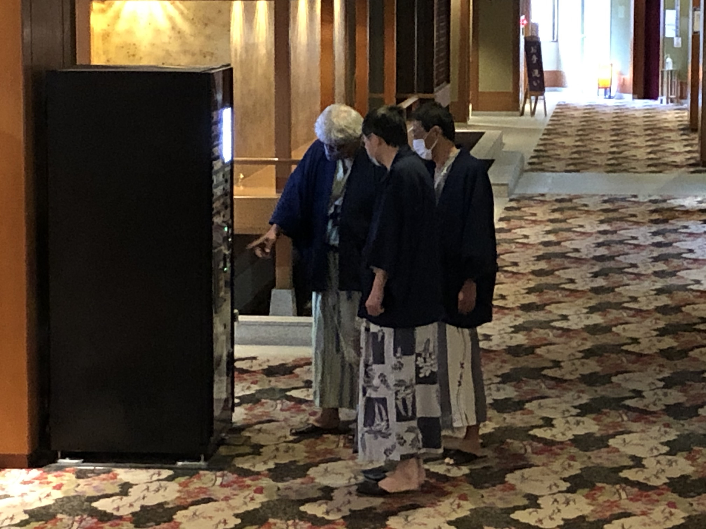

# yunishikawa
<html lang="ja">
 <head>
  <meta charset="utf-8" />
	 

<link href="https://cdnjs.cloudflare.com/ajax/libs/lightbox2/2.7.1/css/lightbox.css" rel="stylesheet">
 
</head>
<body>

  モバイル端末をお使いの場合は、画面を横向きにすると
  より見やすくご覧頂けます。

<!--
<h1><strong>簡易、支払い＆精算計算</strong></h1>

<!--
<section>
<!--
<ul>
<li> <input type="button" id="btn1" value="精算計算  " onclick="btn1Click();" /> 　←　支払い＆精算計算、開始ボタン</li>
</ul>
<!--

    
        </section>-->
                         

<h1><marquee behavior="alternate">!!! 2020年12月12日(土)〜13日(日)@ホテル湯西川 !!!</marquee></h1>

<marquee direction="right" scrollamount="20" width="30%">(^_^)/~hada</marquee>

                             

<h1><marquee behavior="alternate">!!! 2019年12月14日(土)〜15日(日)@ホテル湯西川 !!!</marquee></h1>

<marquee direction="right" scrollamount="20" width="30%">(^_^)/~hada</marquee>

                             

<h3>↓ 画像はクリックで拡大します。スライドショーで閲覧できます。</h3>

<h2>とりあえず、画像を手当たり次第アップしました〜〜(^_^)v。</h2> 

<!--

-->

<h2>石川さんお勧めの酒屋さんで、ドブロクを買いました。。</h2> 

<h2>道の駅で見つけた、ダムカレー。</h2> 

<h2>今回のホテル。</h2> 

<h2>Facebook上に見逃していた写真があったので、さらに追記。</h2> 

<h2>Facebook上の見逃し画像をさらに追記。</h2> 

<h2>初日夕食、動画リンク</h2> 
<iframe width="560" height="315" src="https://www.youtube.com/embed/Akq6nxiSs4g" frameborder="0" allow="accelerometer; autoplay; encrypted-media; gyroscope; picture-in-picture" allowfullscreen></iframe>

   

みなさま 

手持ちの写真でHPを暫定構成してみました。 

 アクセス用QRコード

お手元の写真を共有いただければ、HPに追加しますので、ご連絡下さい。 

羽田 
                  	
	
	

              

 

<!-- フッタ -->
 <footer>
 Copyright 2019/12/14 S.Hada
	</footer>
